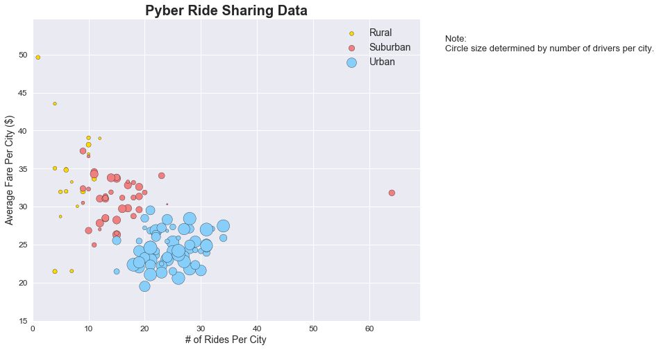
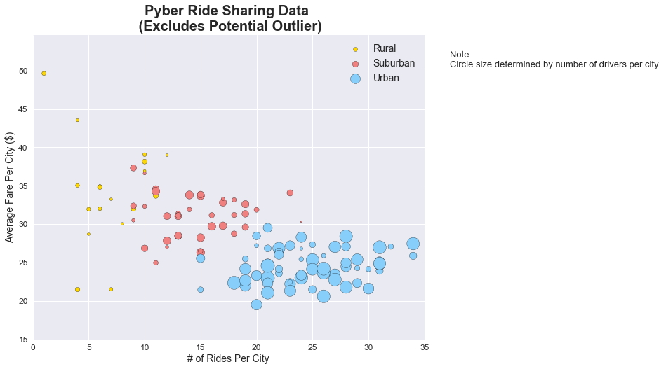
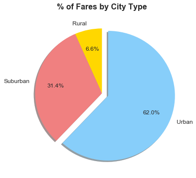
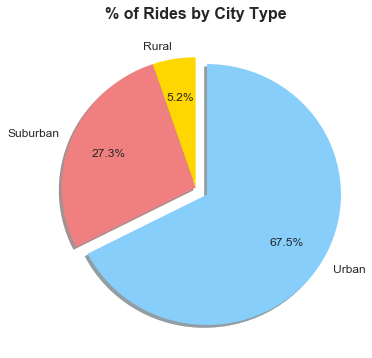
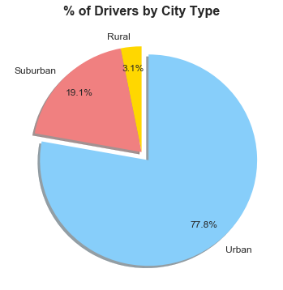

<h1>Observations</h1>
<p>1. The bubble plot shows that the fewer the number of drivers (as shown by the size of the circles), the higher the average fare per city. In general, the smaller circles are higher up on the graph than larger circles. This makes sense given the laws of supply and demand, which says that prices should rise if supply (i.e., the number of drivers) decreases.</p>
<p>2. Cities categorized as urban tend to have more drivers, more rides and lower average fares than cities categorizes as suburban cities. Suburban cities also have tend to have more drivers, more rides and lower average fares than cities categorizes as rural cities.</p>
<p>3. In terms of market share, urban cities have the largest percent of drivers at 75%, but their overall share falls to two-thirds and less than two-thirds for total rides and total fares.  Inversely, the market share for suburban and rural cities is 25% of total drivers and those percentages increase, both individually and as a group, when looking at total rides and total fares. It would be interesting to see how these figures have changed over time.</p>


```python
# Import Dependencies
import matplotlib.pyplot as plt
import pandas as pd
import seaborn as sns

# Set the seaborn chart style
sns.set()

# Increase the size of the bubble charts
plt.rcParams["figure.figsize"] = [10,8]
```


```python
# Import data into pandas from CSV
city_data = 'raw_data/city_data.csv'
ride_data = 'raw_data/ride_data.csv'

city_data_df = pd.read_csv(city_data)
ride_data_df = pd.read_csv(ride_data)
```


```python
# Summary statistics for city data
print(city_data_df.head(10))
print()
print(city_data_df.describe())
print()
print(city_data_df.dtypes)
print()
print(city_data_df.count())
print()
print(city_data_df["type"].value_counts())
```

                    city  driver_count   type
    0         Kelseyland            63  Urban
    1         Nguyenbury             8  Urban
    2       East Douglas            12  Urban
    3      West Dawnfurt            34  Urban
    4     Rodriguezburgh            52  Urban
    5  South Josephville             4  Urban
    6   West Sydneyhaven            70  Urban
    7        Travisville            37  Urban
    8        Torresshire            70  Urban
    9          Lisaville            66  Urban
    
           driver_count
    count    126.000000
    mean      26.579365
    std       21.438415
    min        1.000000
    25%        9.000000
    50%       20.000000
    75%       43.000000
    max       73.000000
    
    city            object
    driver_count     int64
    type            object
    dtype: object
    
    city            126
    driver_count    126
    type            126
    dtype: int64
    
    Urban       66
    Suburban    42
    Rural       18
    Name: type, dtype: int64
    


```python
# Summary statistics for ride data
print(ride_data_df.head(10))
print()
print(ride_data_df.describe())
print()
print(ride_data_df.dtypes)
print()
print(ride_data_df.count())
```

                city                 date   fare        ride_id
    0       Sarabury  2016-01-16 13:49:27  38.35  5403689035038
    1      South Roy  2016-01-02 18:42:34  17.49  4036272335942
    2    Wiseborough  2016-01-21 17:35:29  44.18  3645042422587
    3    Spencertown  2016-07-31 14:53:22   6.87  2242596575892
    4     Nguyenbury  2016-07-09 04:42:44   6.28  1543057793673
    5    New Jeffrey  2016-02-22 18:36:25  36.01  9757888452346
    6  Port Johnstad  2016-06-07 02:39:58  17.15  4352278259335
    7      Jacobfort  2016-09-20 20:58:37  22.98  1500221409082
    8    Travisville  2016-01-15 17:32:02  27.39   850152768361
    9     Sandymouth  2016-11-16 07:27:00  21.61  2389035050524
    
                  fare       ride_id
    count  2375.000000  2.375000e+03
    mean     26.800552  4.865401e+12
    std      12.007118  2.899040e+12
    min       4.050000  2.238753e+09
    25%      17.235000  2.360004e+12
    50%      26.450000  4.821968e+12
    75%      36.635000  7.366161e+12
    max      59.650000  9.997901e+12
    
    city        object
    date        object
    fare       float64
    ride_id      int64
    dtype: object
    
    city       2375
    date       2375
    fare       2375
    ride_id    2375
    dtype: int64
    


```python
# Merge the two dataframes and prints out summary statistics
combined_df = pd.merge(city_data_df, ride_data_df, how='outer', on='city')

print(combined_df.head(10))
print()
print(combined_df.describe())
print()
print(combined_df.dtypes)
print()
print(combined_df.count())
```

             city  driver_count   type                 date   fare        ride_id
    0  Kelseyland            63  Urban  2016-08-19 04:27:52   5.51  6246006544795
    1  Kelseyland            63  Urban  2016-04-17 06:59:50   5.54  7466473222333
    2  Kelseyland            63  Urban  2016-05-04 15:06:07  30.54  2140501382736
    3  Kelseyland            63  Urban  2016-01-25 20:44:56  12.08  1896987891309
    4  Kelseyland            63  Urban  2016-08-09 18:19:47  17.91  8784212854829
    5  Kelseyland            63  Urban  2016-10-24 15:15:46  33.56  4797969661996
    6  Kelseyland            63  Urban  2016-06-06 13:54:23  20.81  9811478565448
    7  Kelseyland            63  Urban  2016-08-10 07:02:40  44.53  1563171128434
    8  Kelseyland            63  Urban  2016-07-05 17:37:13  29.02  6897992353955
    9  Kelseyland            63  Urban  2016-04-25 02:18:31  20.05  1148374505062
    
           driver_count         fare       ride_id
    count    2407.00000  2407.000000  2.407000e+03
    mean       31.14167    26.867104  4.856048e+12
    std        22.05840    12.007238  2.898402e+12
    min         1.00000     4.050000  2.238753e+09
    25%        12.00000    17.320000  2.354637e+12
    50%        24.00000    26.490000  4.804713e+12
    75%        51.00000    36.710000  7.356325e+12
    max        73.00000    59.650000  9.997901e+12
    
    city             object
    driver_count      int64
    type             object
    date             object
    fare            float64
    ride_id           int64
    dtype: object
    
    city            2407
    driver_count    2407
    type            2407
    date            2407
    fare            2407
    ride_id         2407
    dtype: int64
    

<h1>Ride Sharing Data</h1>


```python
# This section displays a bubble chart showing the average fare per city and total number of rides per city.
# The total number of drivers per city is the size of the bubbles and city type is represented by color.

# Slice the combined dataframe for just Rural
rural_df = combined_df.loc[combined_df['type']=='Rural',:]

# Group the rural dataframe by city
rural_group = rural_df.groupby("city")

# Calculate the average fare, total rides and driver count by city
rural_total_rides_by_city = rural_group["ride_id"].count()
rural_avg_fare_by_city = rural_group["fare"].mean()
rural_driver_count_by_city = rural_group["driver_count"].first()

# Slice the combined dataframe for just Urban
urban_df = combined_df.loc[combined_df['type']=='Urban',:]

# Group the urban dataframe by city
urban_group = urban_df.groupby("city")
   
# Calculate the average fare, total rides and driver count by city 
urban_total_rides_by_city = urban_group["ride_id"].count()
urban_avg_fare_by_city = urban_group["fare"].mean()
urban_driver_count_by_city = urban_group["driver_count"].first()

# Slice the combined dataframe for just Suburban
suburban_df = combined_df.loc[combined_df['type']=='Suburban',:]

# Group the suburban dataframe by city
suburban_group = suburban_df.groupby("city")

# Calculate the average fare, total rides and driver count by city 
suburban_total_rides_by_city = suburban_group["ride_id"].count()
suburban_avg_fare_by_city = suburban_group["fare"].mean()
suburban_driver_count_by_city = suburban_group["driver_count"].first()

# Create bubble plots
plt.scatter(rural_total_rides_by_city, rural_avg_fare_by_city, marker="o", facecolors='gold', edgecolors="black",
            s=rural_driver_count_by_city*5, alpha=1)
plt.scatter(suburban_total_rides_by_city, suburban_avg_fare_by_city, marker="o", facecolors='lightcoral', edgecolors="black",
            s=suburban_driver_count_by_city*5, alpha=1)
plt.scatter(urban_total_rides_by_city, urban_avg_fare_by_city, marker="o", facecolors='lightskyblue', edgecolors="black",
            s=urban_driver_count_by_city*5, alpha=1)

# Create a title, x label, and y label
plt.title("Pyber Ride Sharing Data", fontsize=20, fontweight="bold")
plt.xlabel("# of Rides Per City", fontsize=14)
plt.ylabel("Average Fare Per City ($)", fontsize=14)

# Set size of x and y tick labels
plt.tick_params(labelsize=12)

# Add a legend to the chart
plt.legend(('Rural','Suburban','Urban'),loc='best', prop={'size': 14})

# Set x and y limits
plt.xlim(0, max(rural_total_rides_by_city.max(), urban_total_rides_by_city.max(), suburban_total_rides_by_city.max())+5)
plt.ylim(15, max(rural_avg_fare_by_city.max(), urban_avg_fare_by_city.max(), suburban_avg_fare_by_city.max())+5)

# Print out text box with note
plt.gcf().text(0.95, 0.8, "Note:\nCircle size determined by number of drivers per city.", fontsize=13)

# Display bubble chart
plt.show()
```





```python
# This section displays a bubble chart only it excludes the potential outlier in the suburban type. 
# (Port James city with 62 rides and an average fare of $31.80).

# Create bubble plots
plt.scatter(rural_total_rides_by_city, rural_avg_fare_by_city, marker="o", facecolors='gold', edgecolors="black",
            s=rural_driver_count_by_city*5, alpha=1)
plt.scatter(suburban_total_rides_by_city, suburban_avg_fare_by_city, marker="o", facecolors='lightcoral', edgecolors="black",
            s=suburban_driver_count_by_city*5, alpha=1)
plt.scatter(urban_total_rides_by_city, urban_avg_fare_by_city, marker="o", facecolors='lightskyblue', edgecolors="black",
            s=urban_driver_count_by_city*5, alpha=1)

# Create a title, x label, and y label
plt.title("Pyber Ride Sharing Data \n (Excludes Potential Outlier)", fontsize=20, fontweight="bold")
plt.xlabel("# of Rides Per City", fontsize=14)
plt.ylabel("Average Fare Per City ($)", fontsize=14)

# Set size of x and y tick labels
plt.tick_params(labelsize=12)

# Add a legend to the chart
plt.legend(('Rural','Suburban','Urban'),loc='best', prop={'size': 14})

# Set x and y limits
plt.xlim(0, 35)
plt.ylim(15, max(rural_avg_fare_by_city.max(), urban_avg_fare_by_city.max(), suburban_avg_fare_by_city.max())+5)

# Print out text box with note
plt.gcf().text(0.95, 0.8, "Note:\nCircle size determined by number of drivers per city.", fontsize=13)

# Display bubble chart
plt.show()
```





<h1>Total Fares by City Type</h1>


```python
# This section displays a pie chart of fares by city type

# Group the combined dataframe by type
type_group = combined_df.groupby("type")

# Sum up fares by type
fare_total_by_type = type_group["fare"].sum()

# Set explode values for pie chart
pie_explode = (0,0,0.1)

pyber_colors = ['gold', 'lightcoral', 'lightskyblue']
   
# Create pie chart for % of fares by city type
fare_pie = fare_total_by_type.plot(kind="pie", explode=pie_explode, colors=pyber_colors, startangle=90, 
                                   shadow=True, autopct='%1.1f%%', figsize=(6, 6), fontsize=12, pctdistance=0.7) 

# Remove label on y axis and format title
fare_pie.set_ylabel('')
fare_pie.set_title("% of Fares by City Type", fontsize=16, fontweight="bold")


# Display pie chart
plt.show()
```





<h1>Total Rides by City Type</h1>


```python
# This section displays a pie chart of rides by city type

# Sum up fares by type
ride_total_by_type = type_group["ride_id"].count()
   
# Create pie chart for % of rides by city type
ride_pie = ride_total_by_type.plot(kind="pie", explode=pie_explode, colors=pyber_colors, startangle=90, 
                                   shadow=True, autopct='%1.1f%%', figsize=(6, 6), fontsize=12, pctdistance=0.7) 

# Remove label on y axis and format title
ride_pie.set_ylabel('')
ride_pie.set_title("% of Rides by City Type", fontsize=16, fontweight="bold")

# Display pie chart
plt.show()
```





<h1>Total Drivers by City Type</h1>


```python
# This section displays a pie chart of drivers by city type

# Group the combined dataframe by type
driver_group = city_data_df.groupby("type")

# Sum up fares by type
driver_total_by_type = driver_group["driver_count"].sum()
   
# Create pie chart for % of drivers by city type
driver_pie = driver_total_by_type.plot(kind="pie", explode=pie_explode, colors=pyber_colors, startangle=90, 
                                       shadow=True, autopct='%1.1f%%', figsize=(6, 6), fontsize=12, pctdistance=0.8) 

# Remove label on y axis and format title
driver_pie.set_ylabel('')
driver_pie.set_title("% of Drivers by City Type", fontsize=16, fontweight="bold")

# Display pie chart
plt.show()
```




